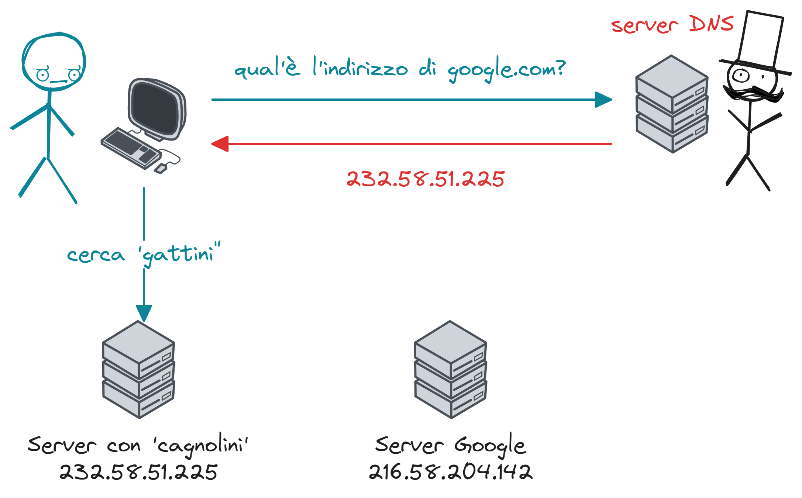

# Hacker 101

<!-- https://datatracker.ietf.org/doc/html/rfc1035 -->

## Introduzione

Quando fate una ricerca su internet, il vostro computer non fa altro che parlare con altri computer in giro per il mondo (ad esempio, quando fate ricerche su **Google**, il vostro computer comunica con i computer di Google)

Il problema è che il vostro computer non può sapere dove stanno tutti gli altri computer del mondo, per questo fa affidamento a dei computer speciali chiamati **DNS** (Domain Name System).

Il vostro computer chiede al server **DNS** "dove sta il computer di **Google**?" e il server **DNS** risponde con l'indirizzo del computer di Google

## Gigi e i gattini

Il vostro amico **Gigi** adora i **gattini** 🐈: ogni giorno cerca foto di gattini su Google.

</img>

**C'è un problema: voi preferite i cagnolini! 🐕**

Per questo avete hackerato il server **DNS** e volete fare in modo che quando **Gigi** cerca **gattini** venga reindirizzato al vostro sito con **cagnolini**.

</img>

## Funzioni da implementare ed esempi

> **NOTA**:
> avete libertà sulle scelte progettuali, ma dovete implementare i metodi richiesti nella classe `Main` per passare i test


Il computer di Gigi scambia con il server **DNS** messaggi con un [formato ben preciso](https://datatracker.ietf.org/doc/html/rfc1035 ) (lunghi **512 byte**). Nei vari test (gradualmente sempre più difficili), lo scopo sarà quello di decodificare i messaggi, e inviare risposte opportune a Gigi (i messaggi DNS, per lo standard di internet, ha il formato sotto... non vi preoccupate, non dobbiamo leggere tutti i campi) 

```dns
                                1  1  1  1  1  1
  0  1  2  3  4  5  6  7  8  9  0  1  2  3  4  5
+--+--+--+--+--+--+--+--+--+--+--+--+--+--+--+--+
|                      ID                       |
+--+--+--+--+--+--+--+--+--+--+--+--+--+--+--+--+
|QR|   Opcode  |AA|TC|RD|RA|   Z    |   RCODE   | <-- flag!
+--+--+--+--+--+--+--+--+--+--+--+--+--+--+--+--+
|                    QDCOUNT                    |
+--+--+--+--+--+--+--+--+--+--+--+--+--+--+--+--+
|                    ANCOUNT                    |
+--+--+--+--+--+--+--+--+--+--+--+--+--+--+--+--+
|                    NSCOUNT                    |
+--+--+--+--+--+--+--+--+--+--+--+--+--+--+--+--+
|                    ARCOUNT                    |
+--+--+--+--+--+--+--+--+--+--+--+--+--+--+--+--+
```

Per poter rispondere a **Gigi**, dobbiamo capire se il messaggio è una **richiesta o una riposta** (per **DNS** entrambi i tipi di messaggio hanno lo stesso formato).

- `public static boolean isRequest(byte[] message);`
    - ritorna `true` se il messaggio è una richiesta, `false` altrimenti 
    - un messaggio **DNS** è un riposta se il primo bit del terzo byte (**QR**) è `1`
    - un messaggio **DNS** è un richiesta se il primo bit del terzo byte (**QR**) è `0`


```java
message = [0x00, 0x01, 0x80, ...] -> false
message = [0x00, 0x87, 0x4F, ...] -> true
message = [0x01, 0x07, 0x07, ...] -> true
message = [0x02, 0xFF, 0xF8, ...] -> false
message = [0xF8, 0x23, 0x74, ...] -> true
```

Ora ci server capire qual'è l'**id** del messaggio (se rispondiamo a **Gigi** con l'**id** sbagliato, lui ignorerà la risposta).

- `public static short getId(byte[] message);`
    - ritorna l'**id** del messaggio **DNS** 
    - l'**id** è il numero dato dai primi due byte del messaggio

```java
message = [0x00, 0x01, ...] -> 1
message = [0x00, 0x87, ...] -> 135
message = [0x02, 0xFF, ...] -> 767
message = [0xF8, 0x23, ...] -> 63523
```

Ora dobbiamo capire quante informazioni ha richiesto **Gigi**.

- `public static short getQueryCount(byte[] message)`
    - ritorna il numero di **risorse** richieste da **Gigi**
    - il numero di **risorse** (ovvero **QDCOUNT**) è dato dai 2 byte dopo i flag 

```java
message = [..., 0x00, 0x01, ...] -> 1 
message = [..., 0x00, 0x10, ...] -> 16
message = [..., 0x69, 0xEA, ...] -> 27114 
message = [..., 0x84, 0xBE, ...] -> 33982 
```


Ora dobbiamo capire quali siti ha effettivamente richiesto **Gigi**. Dopo il 12-esimo byte del messaggio **DNS** (ovvero dopo **ARCOUNT**) ci sono le informazioni che vogliamo.

```java
                              1  1  1  1  1  1
0  1  2  3  4  5  6  7  8  9  0  1  2  3  4  5
+--+--+--+--+--+--+--+--+--+--+--+--+--+--+--+--+
|                                               |
/                                               /
/                      NAME                     /
|                                               |
+--+--+--+--+--+--+--+--+--+--+--+--+--+--+--+--+
|                      TYPE                     |
+--+--+--+--+--+--+--+--+--+--+--+--+--+--+--+--+
|                     CLASS                     |
+--+--+--+--+--+--+--+--+--+--+--+--+--+--+--+--+
|                      TTL                      |
|                                               |
+--+--+--+--+--+--+--+--+--+--+--+--+--+--+--+--+
|                   RDLENGTH                    |
+--+--+--+--+--+--+--+--+--+--+--+--+--+--+--+--|
/                     RDATA                     /
/                                               /
+--+--+--+--+--+--+--+--+--+--+--+--+--+--+--+--+
```

- `public static String[] getDomain(byte[] message)`
    - se `queryCount == 0`, ritorna un array vuoto
    - altrimenti ritorna un array di stringhe che rappresenta il primo dominio (es. *google.com*) richiesto da Gigi

Ad esempio, se Gigi richiede `google.com.wind3.hub`, il campo `NAME` avrà questa sequenza di **byte**

```java
[..., 6, 103, 111, 111, 103, 108, 101, 3, 99, 111, 109, 5, 119, 105, 110, 100, 51, 3, 104, 117, 98, 0, ...]
```

- il primo byte, di valore `6` indica che il prossimo pezzo del dominio è lungo `6` byte
    - infatti `google`, ha 6 caratteri, che in **ASCII** sarebbero `[103, 111, 111, 103, 108, 101]`
- il byte di valore `3` indica che il prossimo pezzo del dominio è lungo `3` byte
    - infatti `com`, ha 3 caratteri, che in **ASCII** sarebbero `[99, 111, 109]`
- il byte di valore `5` indica che il prossimo pezzo del dominio è lungo `5` byte
    - infatti `wind3`, ha 5 caratteri, che in **ASCII** sarebbero `[119, 105, 110, 100, 51]`
- il byte di valore `3` indica che il prossimo pezzo del dominio è lungo `3` byte 
    - infatti `hub`, ha 3 caratteri, che in **ASCII** sarebbero `[104, 117, 98]`

- **l'ultimo byte** è `0`, il che indica la fine del dominio

In questo esempio, il metodo `getDomain()` dovrebbe ritornare `["google", "com", "wind3", "hub"]`

Ora dobbiamo anche riuscire a rispondere a Gigi. Per fortuna, **DNS** ci permette di rispondere, oltre a con indirizzi, anche con altri domini! Quindi, possiamo reindirizzare `google.com` a `google.cagnolini.com`

- `public static byte[] getResponse(short id, String[] domain)`
    - ritorna un array di **512 byte** che rappresenta la risposta con il dominio richiesto
    - i due byte di `id` devono essere impostati in base al valore del parametro `id` 
    - il bit `QR` deve essere impostato a `riposta`
    - il campo `ANCOUNT` deve essere impostato a `1` (stiamo dando una sola risposta)
    - **dopo** il campo `ARCOUNT` va inserito il dominio codificato in byte! (il contrario di quello che faceva `getDomain()`) 

```java
id = 801 e domain = ["google", "com"] -->

[
    0x03, 0x21, // id = 801 
    0x80, 0x00, // QR = risposta
    0x00, 0x00, // QDCOUNT = 0
    0x00, 0x01, // ANCOUNT = 1
    0x00, 0x00, // NSCOUNT = 0
    0x00, 0x00, // ARCOUNT = 0
    0x06, 0x67, 0x6F, 0x6F, 0x67, 0x6C, 0x65, // 6: google
    0x03, 0x63, 0x6F, 0x6D, // 3: com
    0x00, // 0: fine del dominio
    ...(il resto è impostato a 0)
]
```

Bene, ora che riusciamo a decodificare le richieste, e a codificare risposte possiamo finalmente filtrare le richieste di Gigi, e indirizzarlo a siti con cagnolini! 🐕

- `public static byte[][] filterRequests(byte[][] messages)`
    - ritorna un array di risposte ai messaggi ricevuti
    - **per ogni messaggio**
        - se il messaggio non è una richiesta, lo ignoro
        - se il messaggio non ha richieste, lo ignoro
        - altrimenti
            - se il dominio richiesto è `google.com`, rispondo con il dominio `google.cagnolini.com` (con lo stesso `id` della richiesta!)
            - se il dominio contiene la parola `gattini` la si rimpiazza, ad esempio: `qualcosa.gattini.com`, rispondo con `qualcosa.cagnolini.com` (con lo stesso `id` della richiesta!)
            - se il dominio contiene la parola `gatto`, rispondo con `cane.com` (con lo stesso `id` della richiesta!) (ad esempio: `giocattoli.gatto.com`, `gatto.google.com` e `web.gatto.animali.com` diventano tutti `cane.com` nella risposta)
            - in tutti gli altri casi, rispondo con lo stesso dominio richiesto (con lo stesso `id` della richiesta!)
